# 实验报告

---

## 实验过程

---

### 手动安装Ubuntu

#### 下载镜像


- 从官网上下载Ubuntu20.04的镜像


- 然后检查镜像的完整性
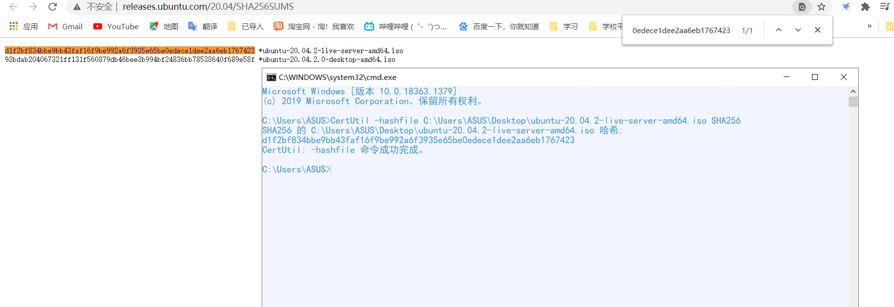

#### 安装Ubuntu

- 新建一个虚拟机
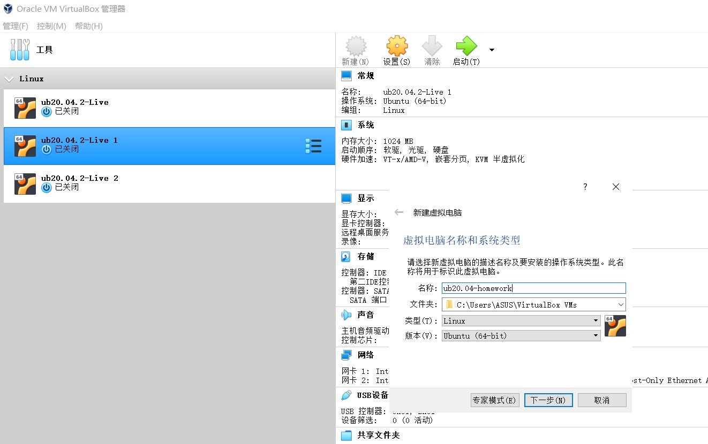

- 配置网卡
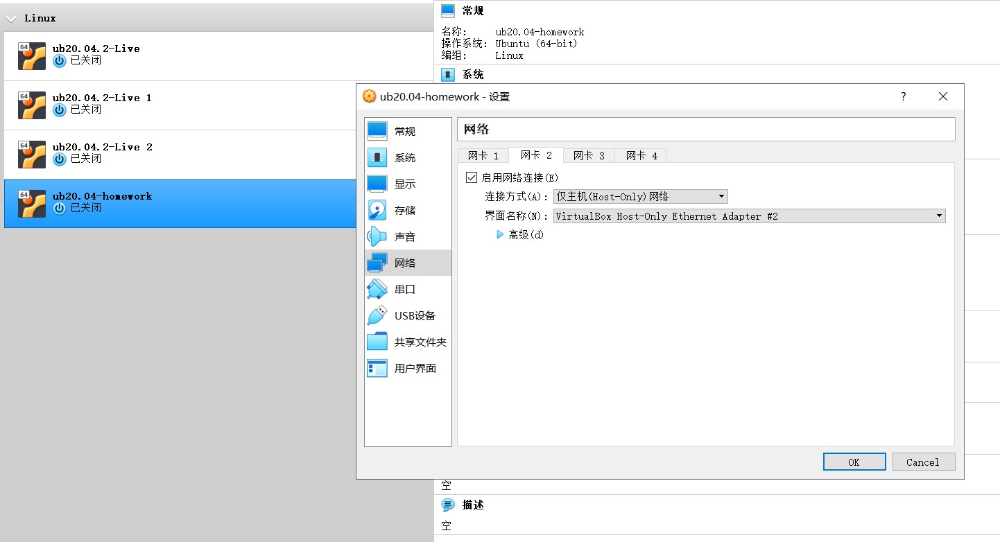
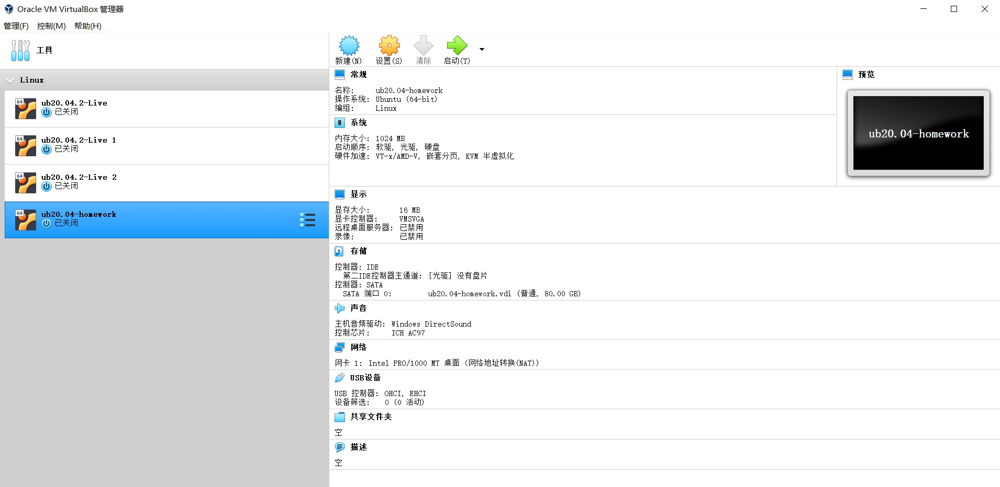

- 设置用户名和密码
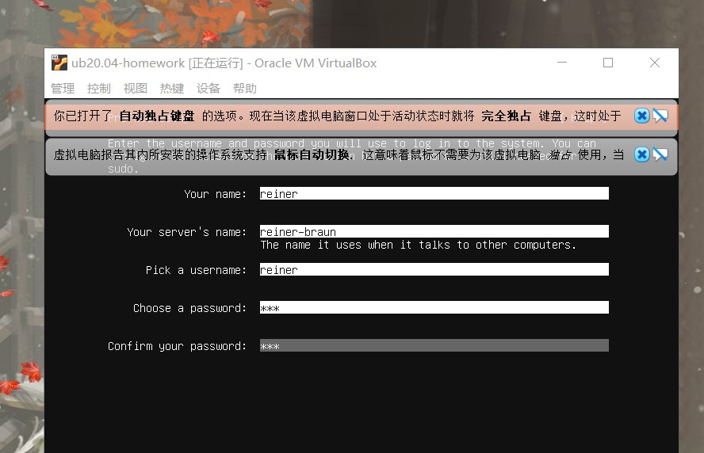

- 安装成功
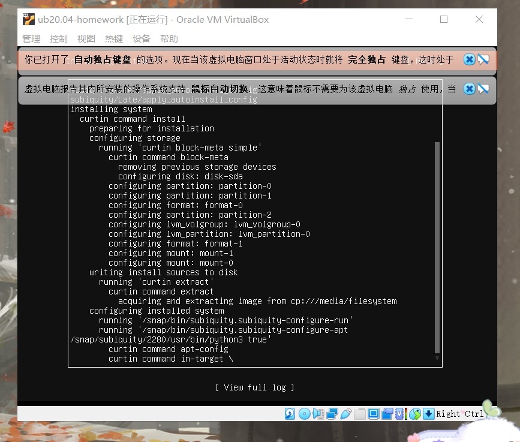
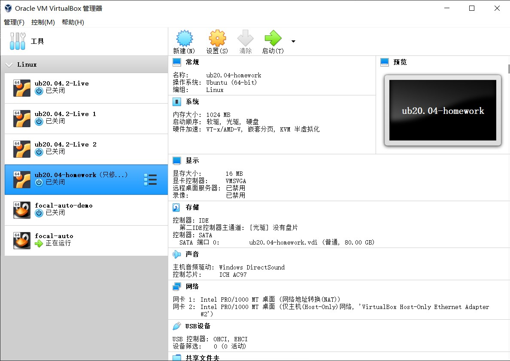

---

### 无人值守的镜像制作

#### 制作user-data和meta-data文件

- 下载autoinstall-user-data文件
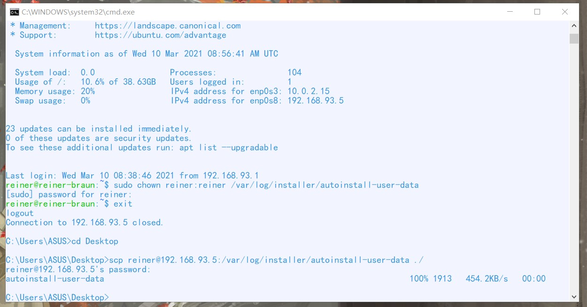

- 修改user-data文件并且创建一个空的meta-data文件


#### 制作cloud-init

- 下载genisoimage
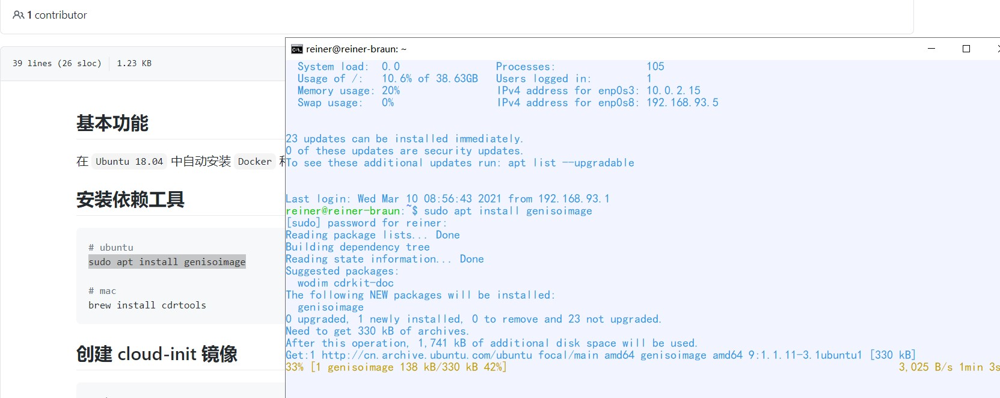

- 将桌面的user-data和meta-data传到Linux中
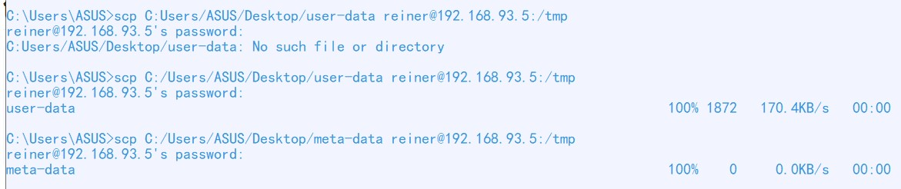

- 生成镜像
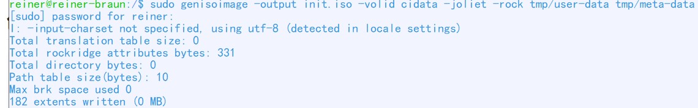

- 将Linux中的init2.iso传到桌面上
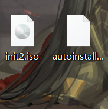

---

## 安装无人值守

- 新建虚拟机
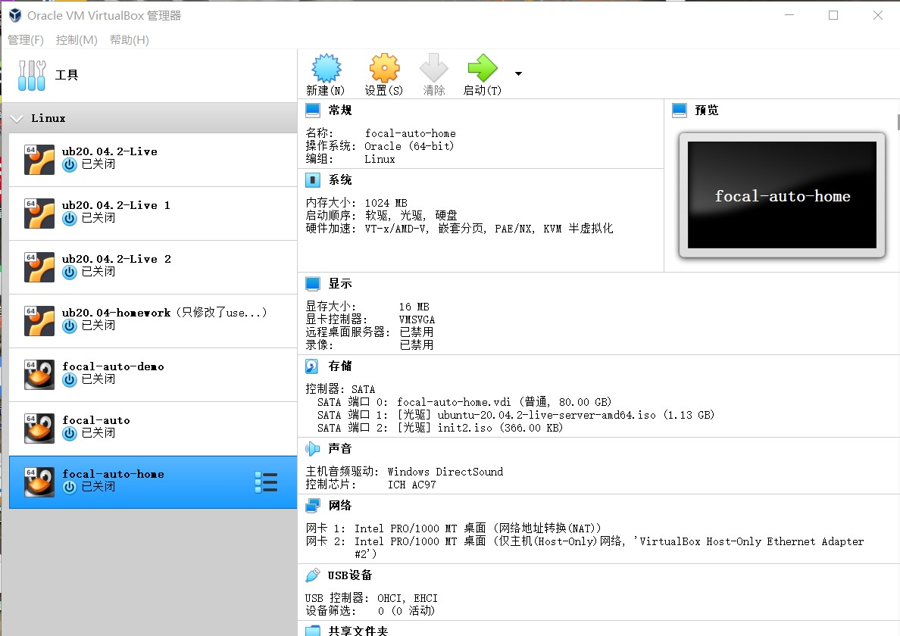

- 安装成功
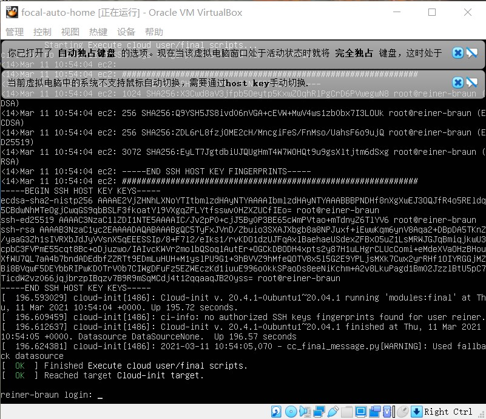

---

## 实验中遇到的问题

#### 问题一

- 下载autoinstall-user-data的时候显示文件不存在
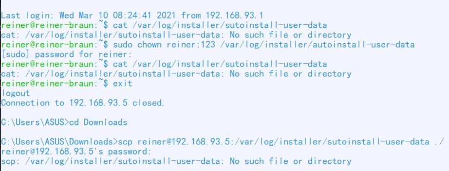

#### 解决方法

传输命令写错，应该写成：
```java
scp reiner@192.168.93.5:/var/log/installer/autoinstall-user-data ./
```

#### 问题二

- 创建镜像的时候的报错：No such file or directory. Invalid node - 'user-data'.
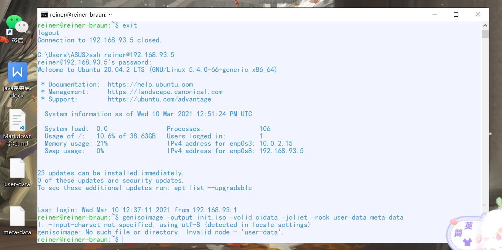

#### 解决方法

将桌面上的user-data和meta-data文件传输到Linux里面
```java
scp C:/Users/ASUS/Desktop/user-data reiner@192.168.93.5:/tmp

scp C:/Users/ASUS/Desktop/meta-data reiner@192.168.93.5:/tmp
```


**注意这里的scp命令是在Windows上的cmd进行的，而不是虚拟机里**

#### 参考资料

[语雀中对此问题的提问](https://www.yuque.com/c4pr1c3/linux/ttkz7y)

#### 问题三

- 用genisoimage命令时找不到user-data和meta-data文件


#### 解决方法

指定user-data和meta-data的路径：
```java
sudo genisoimage -output init.iso -volid cidata -joliet -rock tmp/user-data tmp/meta-data
```

#### 问题四

- 无人值守的时候安装一直卡在一个界面
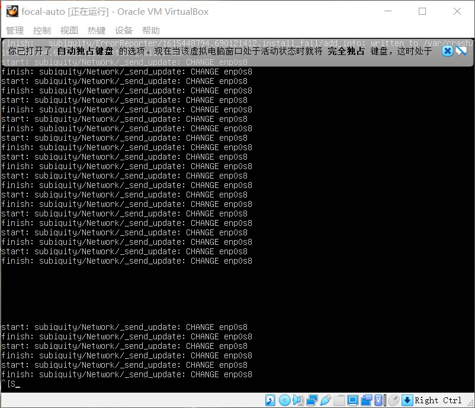

#### 解决方法

配置network-config文件
```java
# This is the network config written by 'subiquity'
version: 2
ethernets:
  enp0s3:
    dhcp4: true
  enp0s8:
    dhcp4: true
    dhcp-identifier: mac
```

- 然后将network-config文件传到虚拟机中，与user-data和meta-data一起生成镜像
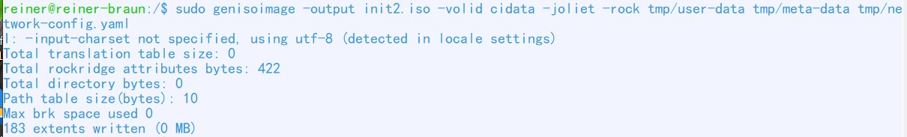

- 最后将init2.iso挂载到虚拟机中就可以了
#### 参考资料
[network-config的配置文件](https://github.com/c4pr1c3/LinuxSysAdmin/blob/master/exp/cloud-init/docker-compose/network-config)