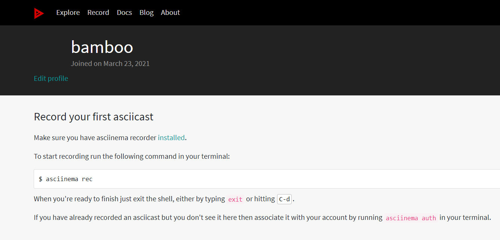

# 实验报告

## 实验目的

学会阅读帮助文档

## 实验步骤

---

#### 一、下载asciinema

```shell
sudo apt install asciinema
```

注意：

因为第一次用官网的命令下载出错，所以换了一台虚拟机，并下载的是Ubuntu自带的asciinema

---

#### 二、asciinema关联本地和在线账号

```shell
asciinema auth
```

复制网址后，进入页面


---

#### 三、观看vimtutor

**- lesson 1**
[](https://asciinema.org/a/1PAzvG9p1TJJoGYb1zQFIby9z)

---

**- lesson 2**
[](https://asciinema.org/a/VQBtQEw8jZjOa11sPvUpuVjis)

---

**- lesson 3**
[](https://asciinema.org/a/UnjKIrCBToNfAaIKLU3R4PoXQ)

---

**- lesson 4**
[](https://asciinema.org/a/tvqdiO12uXWXSoA5YlKATJMj5)

---

**- lesson 5**
[](https://asciinema.org/a/8NWSJClNwCqvs6Q9wCgjTbu7K)

---

**- lesson 6**
[](https://asciinema.org/a/GhMbVEU26ZJ0wlfFrafmEkg37)

---

**- lesson 7**
[](https://asciinema.org/a/vZraytYoNP5ieOozGcYJ3GmpR)

---

## 实验遇到的问题

#### 问题一

lesson 7中，输入```shell
:edit FIL```时，TAB键不能补全

这表示以FIL开头的文件不是独有的

---

#### 问题二

出现不能下载asciinema的问题

**解决方法：**

换一台虚拟机，并用此命令下载：

```shell
sudo apt install asciinema
```