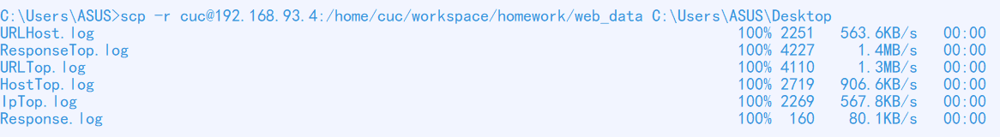

# 实验报告

## 实验环境

- Ubuntu 20.04
- Visual Studio Code
- Git bash
- Window cmd

---

## 实验要求

- [x] 任务一：用bash编写一个图片批处理脚本，实现以下功能：
    - [x] 支持命令行参数方式使用不同功能
    - [x] 支持对指定目录下所有支持格式的图片文件进行批处理
    - [x] 支持以下常见图片批处理功能的单独使用或组合使用
    - [x] 支持对jpeg格式图片进行图片质量压缩
    - [x] 支持对jpeg/png/svg格式图片在保持原始宽高比的前提下压缩分辨率
    - [x] 支持对图片批量添加自定义文本水印
    - [x] 支持批量重命名（统一添加文件名前缀或后缀，不影响原始文件扩展名）
    - [x] 支持将png/svg图片统一转换为jpg格式图片

- [x] 任务二：用bash编写一个文本批处理脚本，对以下附件分别进行批量处理完成相应的数据统计任务：
    * 2014世界杯运动员数据
        - [x] 统计不同年龄区间范围（20岁以下、[20-30]、30岁以上）的球员数量、百分比
        - [x] 统计不同场上位置的球员数量、百分比
        - [x] 名字最长的球员是谁？名字最短的球员是谁？
        - [x] 年龄最大的球员是谁？年龄最小的球员是谁？

- [x] 任务三：用bash编写一个文本批处理脚本，对以下附件分别进行批量处理完成相应的数据统计任务：
    * Web服务器访问日志
        - [x] 统计访问来源主机TOP 100和分别对应出现的总次数
        - [x] 统计访问来源主机TOP 100 IP和分别对应出现的总次数
        - [x] 统计最频繁被访问的URL TOP 100
        - [x] 统计不同响应状态码的出现次数和对应百分比
        - [x] 分别统计不同4XX状态码对应的TOP 10 URL和对应出现的总次数
        - [x] 给定URL输出TOP 100访问来源主机

---

## 实验过程

#### 任务一

1. 将图片所在的整个文件夹传到Linux中

    ```
    scp -r C:/Users/ASUS/Desktop/former_img cuc@192.168.93.4:/home/cuc/workspace/homework
    ```

    

2. 下载imagemagick

    ```shell
    sudo apt-get update

    sudo apt-get install imagemagick
    ```

3. 测试

- 帮助文档

    ```shell
    bash task1.sh -h
    ```

    

- 对jpeg格式图片进行图片质量压缩
    ```shell
    bash task1.sh -d former_img/ -q 40%
    ```

    

- 对jpeg/png/svg格式图片在保持原始宽高比的前提下压缩分辨率
    ```shell
    bash task1.sh -d former_img/ -r 80
    ```
    
    生成的图片：
    

    检查图片的分辨率是否改变：
    ```shell
    identify former_img/1.jpg

    identify later_img/1_resize.jpg
    ```

    

- 对图片批量添加自定义文本水印

    ```shell
    bash task1.sh -d former_img/ -w "wallpaper"
    ```

    

- 重命名文件——统一前缀

    ```shell
    bash task1.sh -d former_img/ -p "prefix"
    ```

    

- 重命名文件——统一后缀

    ```shell
    bash task1.sh -d former_img/ -s "suffix"
    ```

    

- 将png/svg图片统一转换为jpg格式

    ```shell
    bash task1.sh -d former_img/ -c
    ```

    

4. 将later_img文件夹拷贝到桌面上

    ```shell
    scp -r cuc@192.168.93.4:/home/cuc/workspace/homework/later_img C:/Users/ASUS/Desktop
    ```

    

---

#### 任务二

1. 将数据传到Linux中

    ```
    scp C:\Users\ASUS\Desktop\worldcupplayerinfo.tsv cuc@192.168.93.4:/home/cuc/workspace/homework
    ```

    

2. 测试

- 获取帮助文档

    ```shell
    bash task2.sh -h
    ```

    

- 统计不同年龄区间范围（20岁以下、[20-30]、30岁以上）的球员数量、百分比

    ```shell
    bash task2.sh -r
    ```

    

- 统计不同场上位置的球员数量、百分比

    ```shell
    bash task2.sh -p
    ```

    

- 求名字最长和最短的成员

    ```shell
    bash task2.sh -n
    ```

    

- 求年龄最大和最小的成员

    ```shell
    bash task2.sh -y
    ```

    

---

#### 任务三

1. 将数据传到Linux中

    ```
    scp C:\Users\ASUS\Desktop\web_log.tsv cuc@192.168.93.4:/home/cuc/workspace/homework
    ```

    

2. 测试

- 获取帮助文档

    ```shell
    bash task3.sh -h
    ```

    

- 统计访问来源主机TOP 100和分别对应出现的总次数

    ```shell
    bash task3.sh -a 100
    ```

    数据：[HostTop.log](web_data/HostTop.txt)

- 统计访问来源主机TOP 100 IP和分别对应出现的总次数

    ```shell
    bash task3.sh -b 100
    ```

    数据：[IpTop.log](web_data/IpTop.txt)


- 统计最频繁被访问的URL TOP 100

    ```shell
    bash task3.sh -c 100
    ```

    数据：[URLTop.log](web_data/URLTop.txt)


- 统计不同响应状态码的出现次数和对应百分比

    ```shell
    bash task3.sh -d
    ```

    数据：[Response.log](web_data/Response.txt)


- 分别统计不同4XX状态码对应的TOP 10 URL和对应出现的总次数

    ```shell
    bash task3.sh -e 100
    ```

    数据：[ResponseTop.log](web_data/ResponseTop.txt)


- 给定URL输出TOP 100访问来源主机

    ```shell
    bash task3.sh -f "/images/USA-logosmall.gif" 100
    ```

    数据：[URLHost.log](web_data/URLHost.txt)

1. 将数据输出到windows中

    ```
    scp -r cuc@192.168.93.4:/home/cuc/workspace/homework/web_data C:\Users\ASUS\Desktop
    ```

    

---

## 实验扩展

### 练习要求
- [x] 求2个数的最大公约数：通过命令行参数读取2个整数，对不符合参数调用规范（使用小数、字符、少于2个参数等）的脚本执行要给出明确的错误提示信息，并退出代码执行

### 代码及其测试结果

* **代码**

  * [gcd.sh](program_code/gcd.sh)

* **测试结果**

    

---

## 实验遇到的问题

#### 问题一

用find查找文件时，只能找到jpg类型的文件

**解决方法：**

将
```shell
images=$(find "$1" -regex ".*\.jpg\|.*\.png|.*\.jpeg|.*\.svg")
```
改成
```shell
images="$(find "$1" -regex ".*\(jpg\|jpeg\|png\|svg\)")"
```

---

## 参考资料

- [linux-2020-cuc-Lynn](https://github.com/CUCCS/linux-2020-cuc-Lynn/tree/chap0x04/chap0x04)

- [2015-linux-public-JuliBeacon](https://github.com/CUCCS/2015-linux-public-JuliBeacon/tree/exp4/%E5%AE%9E%E9%AA%8C%204)

- [Shell read命令：读取从键盘输入的数据](http://c.biancheng.net/view/2991.html)

- 老师的gcd代码参考：
    

- [scp命令](https://www.runoob.com/linux/linux-comm-scp.html)

- [linux shell指令](https://blog.csdn.net/qq_34457768/article/details/79387779)

- [$filename的用法](https://zhidao.baidu.com/question/409152555.html)